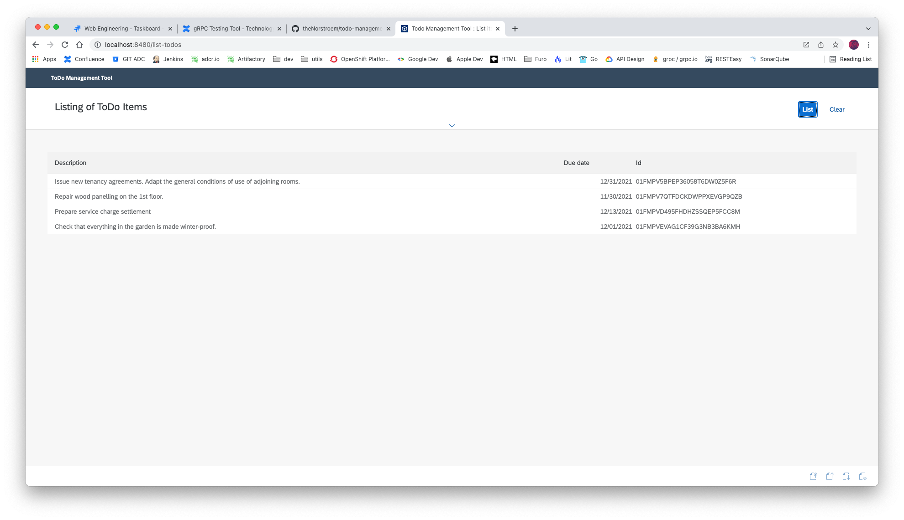
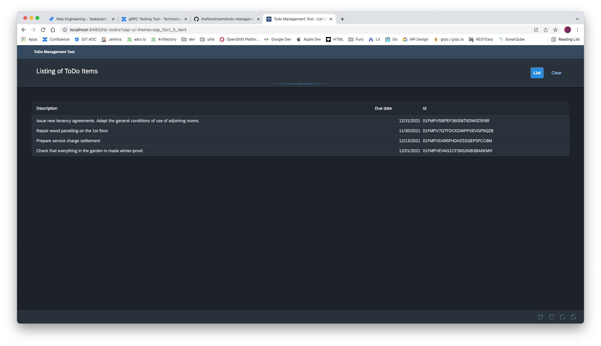

# Creating an enterprise-flavoured ToDo application from scratch with the Furo Web Stack

- _eBook_: [eBook.pdf](./eBook.pdf) [eBook.epub](./eBook.epub)
- _Repository_: https://github.com/theNorstroem/todo-management-tool
- _Furo Web Stack_: https://furo.pro/

## ToDo Application



## System Prerequisites
For this example to fly, the following software components should be installed on the system.
- git, https://git-scm.com/book/en/v2/Getting-Started-Installing-Git
- Docker, https://docs.docker.com/get-docker/
- Go, https://go.dev/doc/install
- NodeJS / npm, https://nodejs.org/en/download/


## Getting Started
We recommend 2+ years of programming experience in JavaScript / HTML / CSS and a basic knowledge of Protocol Buffers. Experiences in Go is also a plus. But don’t worry, you don’t have to be an expert.

download the eBook:
[eBook.pdf](./eBook.pdf) [eBook.epub](./eBook.epub)
The e-book includes a usecase-driven guide through the chapters

clone the repository: 
``` 
git clone git@github.com:theNorstroem/todo-management-tool.git 
```

checkout chapter 01: 
```
git checkout c01_todos_api_contract
```

 
## Final Project Structure
.
|-- LICENSE
|-- README.md
|-- api
|-- client
`-- grpc-backend

## Local API Development

### Use local container build
[Furo build environment docker container](https://github.com/eclipse/eclipsefuro/tree/main/BEC)

https://hub.docker.com/r/thenorstroem/furo-bec

```shell script
docker pull thenorstroem/furo-bec:v1.35.1
```

Example Usage: docker run -it --rm -v $(pwd):$pwd/specs -v ~/.ssh:/root/.ssh thenorstroem/furo-bec:v1.35.1

Commands: https://furo.pro/docs/commands/

**start the furo build environment container from /api**

## Local Web Application Development
All the web application source is located in the subfolder `client`.

### Install dependencies
```
npm i
```

### Starting Web Application in mock mode
```
npm run start:mock
```

### Starting Web Application with backend proxy (backend for frontend)
```
npm run start
```

## Local gRPC Server Development
All the gRPC server code is located in the subfolder `/grpc-backend`.

```
cd grpc-backend
go run ./...
```

or with the built version
```
cd grpc-backend
go install ./cmd/...
tmt-grpc
```

## Local gRPC Gateway
All the gRPC gateway code is located in the subfolder `/api/dist/grpc-gateway`.

```
cd api
GW_SERVER_ADDRESS=localhost:8481 GRPC_SERVER_ADDRESS=localhost:7070 go run ./...
```

or with the built version
```
cd api
go install ./dist/grpc-server/cmd/...
GW_SERVER_ADDRESS=localhost:8481 GRPC_SERVER_ADDRESS=localhost:7070 cmd

```

